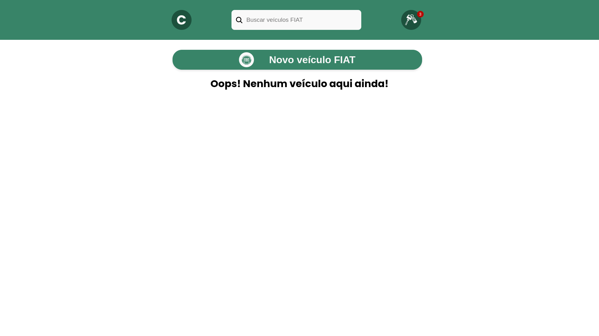
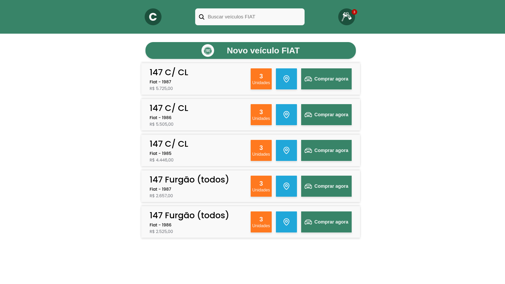

### Desafio Agroger

---

### Descrição Geral

Este repositório é destinado à solução do Desafio Agroger 2025, onde pede o desenvolvimento de um pequeno projeto usando o Vite-React. O foco está na organização do código, clareza na estrutura, boas práticas de nomenclatura, componentização, separação da lógica, chamadas HTTP e testes unitários. É pedido para componentizar uma interface que foi dada como exemplo, porém o domínio (assunto) poderia ser qualquer um contanto que dimensões só estivessem proporcionais. E pensando nisso, criei a minha interface focada no meio automobilístico, o único requisito funcional é um botão que deve fazer uma requisição HTTP a um endpoint público e exibir os dados recebidos em uma lista, e para a api que utilizei foi a FIPE API.

---

### Descrição da Aplicação

Como dito anteriormente, a aplicação possui apenas um requisito funcional. Para criar as chamadas HTTP, utilizei o Axios, criando primeiramente uma baseURL e passando parâmetros para chegar ao endpoint específico para o contexto de cada requisição.

A aplicação foi estilizada usando SASS, que é um pré-processador de CSS, seguindo as boas práticas e patterns necessários para aplicá-la da melhor forma. O desenvolvimento seguiu boas práticas de arquitetura, aplicando o Composition Pattern para organizar os componentes de forma reutilizável e modular.

### Tecnologias usadas

- ReactJS
- AXIOS
- Jest
- Typescript

 

### Estrutura da Aplicação

<pre style="overflow-x: auto; max-width: 1000px; white-space: pre;">
public/
src/
│── components/        # Armazena os componentes da aplicação
│── hooks/             # Contém hooks personalizados para lógica compartilhada
│── pages/             # Define as páginas da aplicação
│── sass/              # Arquivos de estilização utilizando SASS
│── services/          # Contém serviços responsáveis por chamadas HTTP e lógica de negócios
│   ├── api.ts         # Configuração do Axios e integração com APIs externas
│── App.tsx            # Componente raiz da aplicação
│── main.tsx           # Arquivo de entrada que inicializa o React e renderiza o App
│── setupTests.ts      # Configuração inicial para testes unitários
│── vite-env.d.ts      # Definições de tipos para o Vite
</pre>

### Como usar a aplicação?

 

**Instalação:**

- Primeiramente, você deve usar o comando: `git clone https://github.com/CaioSousaa/Desafio-Agroger.git` para clonar o projeto na sua máquina.
- Após isso, rode o comando `npm install` para instalar as dependências e gerar a pasta node_modules
- Após isso, o projeto está pronto para rodar usando o comando `npm run dev`

### TELAS

## HOME

## Card de requisições

